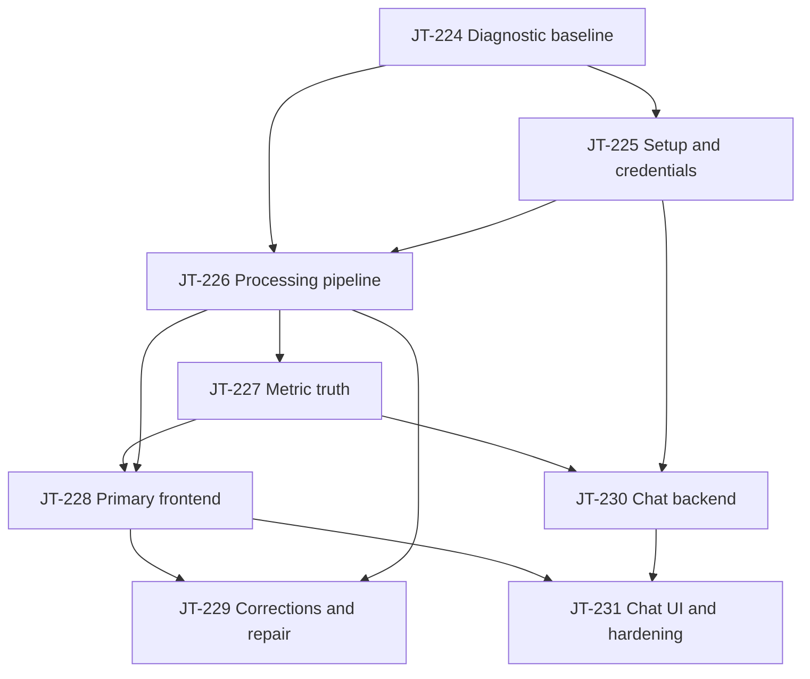

# Active Dependency Module

This module defines the active stabilization backlog after the broad phase backlog was superseded.
The goal is to make the platform work end to end before adding more isolated feature tickets.

## Execution Stages

### Stage 1

- JT-224: Stabilize end-to-end diagnostic baseline.

### Stage 2

- JT-225: Repair setup, provider configuration, and credential readiness.

### Stage 3

- JT-226: Operationalize processing from sync to applications.

### Stage 4

- JT-227: Correct metric truth and reconciliation.

### Stage 5

- JT-228: Make the primary frontend operational.
- JT-230: Build grounded chat backend and retrieval pipeline.

JT-228 and JT-230 can run in parallel after JT-227.

### Stage 6

- JT-229: Expose corrections, conflicts, and data repair workflows.
- JT-231: Ship chat UI and release hardening.

JT-229 depends on the primary frontend shell being operational.
JT-231 depends on both the primary frontend and the chat backend.

## Dependency Table

| Ticket | Depends on | Blocks |
|---|---|---|
| JT-224 | None | JT-225, JT-226, JT-227, JT-228, JT-229, JT-230, JT-231 |
| JT-225 | JT-224 | JT-226, JT-230 |
| JT-226 | JT-224, JT-225 | JT-227, JT-228, JT-229 |
| JT-227 | JT-224, JT-226 | JT-228, JT-230 |
| JT-228 | JT-224, JT-226, JT-227 | JT-229, JT-231 |
| JT-229 | JT-224, JT-226, JT-228 | None |
| JT-230 | JT-224, JT-225, JT-227 | JT-231 |
| JT-231 | JT-228, JT-230 | None |

## GitHub Issue Links

| Ticket | GitHub issue |
|---|---|
| JT-224 | https://github.com/talibilat/job-search-intelligence/issues/441 |
| JT-225 | https://github.com/talibilat/job-search-intelligence/issues/442 |
| JT-226 | https://github.com/talibilat/job-search-intelligence/issues/443 |
| JT-227 | https://github.com/talibilat/job-search-intelligence/issues/444 |
| JT-228 | https://github.com/talibilat/job-search-intelligence/issues/445 |
| JT-229 | https://github.com/talibilat/job-search-intelligence/issues/446 |
| JT-230 | https://github.com/talibilat/job-search-intelligence/issues/447 |
| JT-231 | https://github.com/talibilat/job-search-intelligence/issues/448 |

## Mermaid Graph

